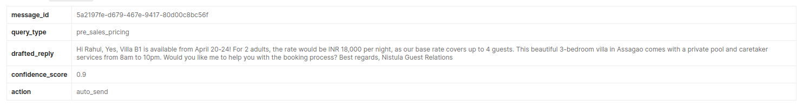

# Nistula — Guest Message Webhook

A webhook that receives guest messages from multiple booking channels, classifies them, drafts a reply via Claude, and routes it based on a real confidence score.

Built for the Nistula Summer Technology Internship 2026 Technical Assessment.

---

## What it does

```
POST /webhook/message
        │
        ▼
Validate input fields
        │
        ▼
Classify message into query type (rule-based, complaints first)
        │
        ▼
Call Claude with property context + query type
Claude drafts a reply AND self-rates how grounded it is (tool_use)
        │
        ▼
Compute confidence score from real signals (Claude rating + message signals + classifier signal)
        │
        ▼
Return: message_id, query_type, drafted_reply, confidence_score, action
```

---

## Project structure

```
src/
├── index.js          ← Express app, route handler, structured logging
├── config.js         ← env loading, fail-fast on missing key
├── schemas.js        ← input validation with length caps and ISO-8601 check
├── classifier.js     ← rule-based query classifier with word-boundary regex
├── claudeClient.js   ← Anthropic SDK, tool_use → { draft, self_rating }
├── confidence.js     ← signal-based confidence scoring (not hardcoded priors)
├── properties.js     ← property context registry, keyed by property_id
└── utils.js          ← UUID v4
tests/
├── classifier.test.js
├── confidence.test.js
└── schema.test.js
schema.sql            ← Part 2: PostgreSQL schema
thinking.md           ← Part 3: written answers
.env.example          ← environment variable template
```

---

## Prerequisites

| | |
|---|---|
| Node.js | 18 or newer |
| npm | 9 or newer |
| Anthropic API key | [console.anthropic.com](https://console.anthropic.com) |

---

## Setup

```bash
git clone https://github.com/<your-username>/nistula-technical-assessment
cd nistula-technical-assessment

npm install

cp .env.example .env
# Open .env and paste your ANTHROPIC_API_KEY
```

---

## Running

```bash
# Start the server
npm start
# → {"ts":"...","level":"info","event":"server.start","port":3000}

# Health check
curl http://localhost:3000/health
# → {"status":"ok"}

# Run unit tests (no API key needed)
node --test
# → 23 tests, all pass
```

The server exits immediately at startup if `ANTHROPIC_API_KEY` is missing — better than failing silently mid-request.

---

## Endpoint

### `POST /webhook/message`

**Request fields**

| Field | Type | Validation |
|---|---|---|
| `source` | string | One of: `whatsapp`, `booking_com`, `airbnb`, `instagram`, `direct` |
| `guest_name` | string | Required, max 255 chars |
| `message` | string | Required, max 4000 chars |
| `timestamp` | string | Required, valid ISO-8601 with timezone |
| `booking_ref` | string | Required, max 100 chars |
| `property_id` | string | Required, must exist in property registry |

**Example request**

```bash
curl -s -X POST http://localhost:3000/webhook/message \
  -H 'Content-Type: application/json' \
  -d '{
    "source": "whatsapp",
    "guest_name": "Rahul Sharma",
    "message": "Is the villa available from April 20 to 24? What is the rate for 2 adults?",
    "timestamp": "2026-05-05T10:30:00Z",
    "booking_ref": "NIS-2024-0891",
    "property_id": "villa-b1"
  }'
```

**Example response**

```json
{
  "message_id": "c1b7e7c2-2b31-4a74-9c4f-9d1d3ef2d421",
  "query_type": "pre_sales_pricing",
  "drafted_reply": "Hi Rahul! Great news — Villa B1 is available from April 20 to 24. For 2 adults the rate is INR 18,000 per night. Would you like me to hold the dates for you?",
  "confidence_score": 0.92,
  "action": "auto_send"
  //  This was included in the response for Testing how good our confidence scoring is, but now commented out.!
  // "confidence_signals": {
  //   "keyword_match_count": 2,
  //   "self_rating": { "had_all_facts": true, "hedged": false, "missing_facts": [] },
  //   "penalty_reasons": []
  // }
}
```

> **Note:** This is a POSTMAN Response Preview



`confidence_signals` is included in the response so reviewers and downstream systems can see exactly which signals drove the score — every deduction is named, but now commented out.!

---

## Test payloads

Three payloads to run before submitting. Each covers a different classification bucket and expected action.

**1. Availability + pricing — expects `auto_send`**

```bash
curl -s -X POST http://localhost:3000/webhook/message \
  -H 'Content-Type: application/json' \
  -d '{
    "source": "whatsapp",
    "guest_name": "Rahul Sharma",
    "message": "Is the villa available from April 20 to 24? What is the rate for 2 adults?",
    "timestamp": "2026-05-05T10:30:00Z",
    "booking_ref": "NIS-2024-0891",
    "property_id": "villa-b1"
  }'
```

**2. Post-booking check-in — expects `auto_send` or `agent_review`**

```bash
curl -s -X POST http://localhost:3000/webhook/message \
  -H 'Content-Type: application/json' \
  -d '{
    "source": "booking_com",
    "guest_name": "Priya Mehta",
    "message": "Hi, what time can we check in? Also can you share the WiFi password?",
    "timestamp": "2026-05-08T14:00:00Z",
    "booking_ref": "NIS-2024-0934",
    "property_id": "villa-b1"
  }'
```

**3. Complaint — always expects `escalate`**

```bash
curl -s -X POST http://localhost:3000/webhook/message \
  -H 'Content-Type: application/json' \
  -d '{
    "source": "instagram",
    "guest_name": "Vikram Nair",
    "message": "The AC is not working and it is 35 degrees. This is completely unacceptable. I want a refund.",
    "timestamp": "2026-05-09T02:15:00Z",
    "booking_ref": "NIS-2024-0902",
    "property_id": "villa-b1"
  }'
```

---

## Query classification

Rule-based. A prioritised list of keyword buckets compiled into word-boundary regexes at module load (`\b` prevents `"to"` matching inside `"tomorrow"` and `"may"` matching inside `"maybe"`). Complaints are evaluated first — a message with any complaint keyword escalates regardless of other signals.

| Priority | Type | Trigger keywords (sample) |
|---|---|---|
| 1 | `complaint` | not working, broken, unacceptable, refund, no hot water, angry |
| 2 | `post_sales_checkin` | check-in, wifi, checkout, key, directions |
| 3 | `special_request` | early check-in, airport transfer, chef, birthday, extra bed |
| 4 | `pre_sales_pricing` | rate, price, cost, how much, per night, discount |
| 5 | `pre_sales_availability` | available, book villa, dates, nights, month names |
| 6 | `general_enquiry` | fallback — matches everything else |

The classifier also returns a keyword match count, which feeds directly into the confidence scorer.

In production this would be replaced by a small fine-tuned classifier or a fast `claude-haiku` call that returns per-bucket probabilities — but rule-based is deterministic, fast, and auditable, which is the right call for this scope.

---

## Confidence scoring

**The key design choice:** confidence is not a hardcoded category prior. `BASE_SCORES['pre_sales_pricing'] = 0.90` returns the same number whether Claude had the facts to answer or was making things up. That tells you nothing real.

Instead, confidence starts at **0.95** and is reduced by observable risk signals. Every penalty is named and surfaced in `confidence_signals.penalty_reasons` so the score is always explainable.

### How Claude self-rates (one call, not two)

`claudeClient.js` forces Claude to call a `submit_reply` tool in the same response turn. The tool requires four fields alongside the draft:

```json
{
  "reply_text": "Hi Rahul, ...",
  "had_all_facts": true,
  "hedged": false,
  "missing_facts": []
}
```

This is structured output via `tool_use` with `tool_choice: { type: 'tool', name: 'submit_reply' }`. Claude cannot write a reply without also reporting whether it had to speculate. No second grading call, no added latency.

### Penalty table

| Signal | Source | Deduction | Why |
|---|---|---|---|
| `had_all_facts === false` | Claude self-rating | −0.20 | Model itself flagged missing context → hallucination risk |
| `hedged === true` | Claude self-rating | −0.10 | "I'll check" means the reply isn't actually answering |
| Each item in `missing_facts[]` | Claude self-rating | −0.05 each, max −0.20 | Each named gap is a real unanswered question |
| Message under 5 words | Message | −0.10 | "Is it available?" without dates is ambiguous |
| 2+ question marks | Message | −0.03 | Multiple intents in one message → harder to answer cleanly |
| 0 keyword matches | Classifier | −0.05 | Fell through to fallback; classification is weak |
| Exactly 1 keyword match | Classifier | −0.02 | Weak single signal |
| `query_type === complaint` | Hard rule | Cap at 0.55 | Always escalate regardless of how grounded Claude felt |

Final score is clamped to `[0.0, 1.0]` and rounded to 2 decimal places.

### Action routing

| Condition | Action |
|---|---|
| `query_type === complaint` | `escalate` — hard rule, ignores score |
| `confidence >= 0.85` | `auto_send` |
| `0.60 <= confidence < 0.85` | `agent_review` |
| `confidence < 0.60` | `escalate` |

---

## Property context

Property facts (rate, WiFi, caretaker hours, availability, etc.) live in `src/properties.js`, keyed by `property_id`. `claudeClient.js` calls `properties.getById(property_id)` on every request — the `property_id` field in the webhook payload is actually doing work, not being ignored.

If `property_id` is unknown, the handler returns `400` immediately with the list of known IDs. No point calling Claude with no context.

The registry shape mirrors the `properties` table in `schema.sql`. Swapping it for a DB-backed lookup is a one-function change — the rest of the system is unaffected.

---

## Error handling

| Situation | Status | Response |
|---|---|---|
| Missing or invalid required field | `400` | `{ "error": "Validation failed", "details": ["..."] }` |
| Unknown `property_id` | `400` | `{ "error": "Unknown property_id: ...", "details": ["known property_ids: ..."] }` |
| Malformed JSON body | `400` | `{ "error": "Invalid JSON body" }` |
| Claude API failure or timeout | `503` | `{ "error": "AI service temporarily unavailable. Please try again shortly." }` |
| Unexpected server error | `500` | `{ "error": "Internal server error" }` — full stack trace logged to stderr |

All errors are logged as structured JSON with a `requestId` that is echoed in the `X-Request-Id` response header. No error is silently swallowed.

---

## Tests

```bash
node --test
```

- `tests/classifier.test.js` — priority ordering, complaint-first rule, case-insensitivity, word-boundary correctness, match count accuracy, fallback behaviour.
- `tests/confidence.test.js` — each penalty in isolation, stacking behaviour, complaint cap, action thresholds at the boundary values (0.60 and 0.85).
- `tests/schemas.test.js` — thorough payload validation covering strict ISO-8601 parsing, length limits, type-checking, and comprehensive multiple-error collection.

Pure functions. No API key or database required.

---

## Assumptions

1. **No database wired up for Part 1.** `schema.sql` is the design artefact for Part 2. Persistence of conversations and messages is not implemented in the webhook — see *Roadmap*.
2. **Property context is the source of truth for Claude.** Claude is instructed to use only what it is given and to report any missing facts via `missing_facts[]`. It will not invent rates, availability, or policies.
3. **`timestamp` is trusted, not semantically validated.** Format is checked (ISO-8601 with timezone); the calling PMS is the source of truth for the value.
4. **No webhook authentication.** A real integration would require per-channel HMAC signature verification (Twilio for WhatsApp, Booking.com webhook secrets, etc.).
5. **One attempt per request.** No retry on transient Claude failures — the caller receives `503` and retries. Avoids cost spirals from cascading retries.
6. **Claude's self-rating is trusted.** If Claude reports `had_all_facts: true` but hallucinated, the score will be optimistically high. This is a known limitation of self-assessment. The `agent_review` band (0.60–0.85) is the human safety net for borderline cases.

---

## Roadmap

Items deliberately deferred from this submission, in rough priority order:

- **Wire `schema.sql` to a live Postgres pool.** Replace `src/properties.js` with a DB `SELECT`. Persist every inbound message, AI draft, and action taken before returning the response, so the audit trail exists even if the caller drops the connection.
- **Webhook authentication.** Per-channel HMAC verification for WhatsApp (Twilio signature), Booking.com, and Airbnb.
- **Idempotency.** Unique key on `(source_channel, external_message_id)` — already in the schema — to prevent duplicate Claude calls on webhook retries.
- **Repeat-complaint detector.** Query `messages` for `(property_id, query_type = 'complaint', received_at > 60 days ago)` count. Auto-open a maintenance task and flag the property health dashboard when threshold is breached. Requires the DB to be wired in.
- **Replace rule-based classifier.** A fast `claude-haiku` classification call returning per-bucket probabilities, fed into confidence as a "classifier certainty" signal.
- **Stream the draft.** When action is `agent_review`, stream Claude's output to the agent UI so they can start editing before generation completes.
- **Structured logging with pino.** Drop-in replacement for the current `JSON.stringify` approach, with log levels, redaction of PII, and log shipping.
- **Integration tests against a real Postgres** in CI using a Docker Compose fixture.

---

*Built for the Nistula Summer Technology Internship 2026 Technical Assessment.*
